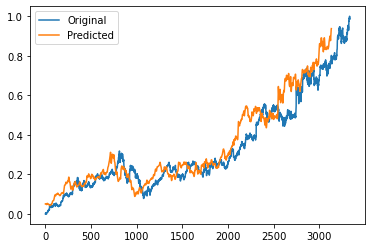

# Closing Stock Price Prediction using LSTM

## Note:-
    In this repository I've used Google's data. For any other company just fork the Kaggle notebook and set the "ticker_symbol"
    variable at the beginning of the notebook with any ticker symbol of your choice listed in NYSE/NASDAQ.

## Kaggle Notebook Link:-
    https://www.kaggle.com/pradip11/stock-price-prediction-with-stacked-lstm

## Language:-
    Python3
    
## IDE:-
    Jupyter Notebook
    
## Library Requirements:-
1. numpy
2. pandas
3. matplotlib
4. seaborn
5. tensorflow

## Data Source:-
    https://www.kaggle.com/borismarjanovic/price-volume-data-for-all-us-stocks-etfs
    
## Result:-

